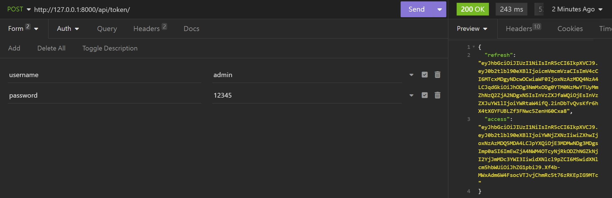
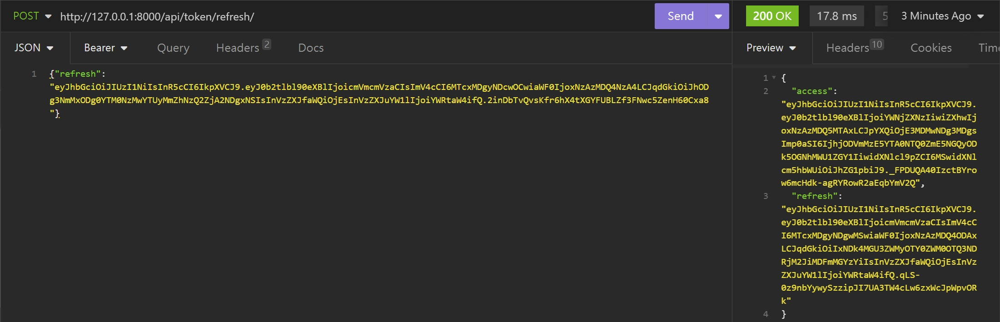

# Little Lemon Restaurant Back End

This marks the culmination of the Meta Back-End Developer Course on Coursera, showcasing a Django web application
tailored for the Little Lemon restaurant. For Front-End counter part, check
out [Little Lemon Front-End](https://github.com/r95222023/Little-Lemon-Front-End)

## Framework

This project was initialized using Django and incorporates djangorestframework with Simple-JWT for authentication.

## Features

- Utilizes the Django framework to deliver static HTML content
- JWT (JSON Web Token) authentication is implemented
- GUI for Register, Login and Logout functionality
- Establishes a connection between the backend and a MySQL database
- Incorporates APIs for both menu functionality and table reservations
- Configured with user registration and authentication features
- Includes a suite of unit tests
- The API is testable using the Insomnia REST client

## Packages Used

- django
- mysqlclient
- django-cors-headers
- djangorestframework-simplejwt

## Setup

To use this application, follow these steps:

1. Clone the repository from GitHub.

    ```bash
    git clone https://github.com/r95222023/Little-Lemon-Back-End.git
    ```
   <br>
2. Install the necessary dependencies within the virtual environment and then activate the virtual environment.
    ```bash
    pipenv install
    ```
    ```bash
    pipenv shell
    ```
   <br>
3. Establish a MySQL database and configure the application to utilize it.
   In the settings.py file, modify the default database settings to:

   ```jsx
   DATABASES = {
      'default': {
            'ENGINE': 'django.db.backends.mysql',
            'NAME': 'littlelemon',
            'HOST': 'localhost',
            'PORT': '3306',
            'USER': '[your username]',
            'PASSWORD': '[your password]',
            'OPTIONS': {
                'init_command': "SET sql_mode='STRICT_TRANS_TABLES'",
            },
        },
   }
   ```
   Important:
    - Use the username and password of the MySql superuser as your credentials in the **settings.py** file.
    - The 'django.db.backends.mysql' engine is incompatible with ARM-based machines. Please install
      mysql-connector-python using either pip or pipenv. Alternatively, if you are utilizing the mysqlclient connector,
      uncomment the **'django.db.backends.mysql'** line in the **settings.py** file, and comment out the line below it
      to
      successfully establish a database connection.

   <br>
4. Apply the migrations.
   ```bash
   python manage.py makemigrations
   ```
   ```bash
   python manage.py migrate
   ```

## Usage

1. To initiate the server, use the following command:
   ```bash
   python manage.py runserver
   ```
2. For code testing, execute the following command:

## Testing

For code testing, execute the following command:

```bash
   python manage.py test restaurant/Tests
```

The API can also be tested using the Insomnia REST client or other tools.

## API endpoints

There are four distinct categories of API endpoints, auth, booking ,menu, and web pages.

### Auth

On the website, the following get/refresh token operations are seamlessly performed behind the scenes.
After a user logs in, the browser consistently refreshes the tokens and stores them in localStorage, ensuring that the
access token does not expire. The acquired tokens will be appended to the request header, enabling users to access
services that require authorization with ease.

```/api/token/```

| METHOD | ACTION                        | PAYLOAD           | STATUS CODE |
|--------|-------------------------------|-------------------|-------------|
| POST   | Get JWT access/refresh tokens | username/password | 200         |

In Insomnia, get the token as follows


```/api/token/refresh```

| METHOD | ACTION                            | PAYLOAD       | STATUS CODE |
|--------|-----------------------------------|---------------|-------------|
| POST   | Refresh JWT access/refresh tokens | refresh token | 200         |

Post refresh token to get new tokens


```/register/```
This  can be done by click the "No account? Click to register" link below the Login button on the login page or by using
a POST request. "The password creation validation on the website is stringent. 
Please use something like username: Mario, password: ABCD-12345."

| METHOD | ACTION          | PAYLOAD              | STATUS CODE |
|--------|-----------------|-------------------|-------------|
| POST   | Register a user | username/password | 200         |

### Booking
To reserve a table, the user must be logged in with a JWT token. Once logged in on the website, a user can easily 
proceed to book a table.

```/book_api/```

| METHOD | ACTION                 | PAYLOAD      | AUTH REQUIRED | STATUS CODE |
|--------|------------------------|--------------|---------------|-------------|
| GET    | Retrieves all bookings | none         | no            | 200         |
| POST   | Book a table           | booking form | JWT Token     | 200         |

### Menu
To add menu items, navigate to http://127.0.0.1:8000/admin and log in using the superuser account you created.

```/menu/```

| METHOD | ACTION                   | PAYLOAD      | AUTH REQUIRED | STATUS CODE |
|--------|--------------------------|--------------|---------------|-------------|
| GET    | Retrieves all menu items | none         | no            | 200         |

```/menu_item/```

| METHOD | ACTION                     | PAYLOAD      | AUTH REQUIRED | STATUS CODE |
|--------|----------------------------|--------------|---------------|-------------|
| GET    | Retrieves single menu item | none         | no            | 200         |


### Web pages

```/```

| METHOD | VIEW      | PAYLOAD      | AUTH REQUIRED | STATUS CODE |
|--------|-----------|--------------|---------------|-------------|
| GET    | Home page | none         | no            | 200         |

```/login/```

| METHOD | VIEW       | PAYLOAD      | AUTH REQUIRED | STATUS CODE |
|--------|------------|--------------|---------------|-------------|
| GET    | Login page | none         | no            | 200         |

```/register/```

| METHOD | VIEW          | PAYLOAD      | AUTH REQUIRED | STATUS CODE |
|--------|---------------|--------------|---------------|-------------|
| GET    | Register page | none         | no            | 200         |

```/about/```

| METHOD | VIEW       | PAYLOAD      | AUTH REQUIRED | STATUS CODE |
|--------|------------|--------------|---------------|-------------|
| GET    | About page | none         | no            | 200         |

```/menu/```

| METHOD | VIEW      | PAYLOAD      | AUTH REQUIRED | STATUS CODE |
|--------|-----------|--------------|---------------|-------------|
| GET    | Menu page | none         | no            | 200         |

```/booking/```

| METHOD | VIEW              | PAYLOAD      | AUTH REQUIRED | STATUS CODE |
|--------|-------------------|--------------|---------------|-------------|
| GET    | Reservations page | none         | no            | 200         |

```/book/```

| METHOD | VIEW              | PAYLOAD      | AUTH REQUIRED | STATUS CODE |
|--------|-------------------|--------------|---------------|-------------|
| GET    | Reservations page | none         | no            | 200         |